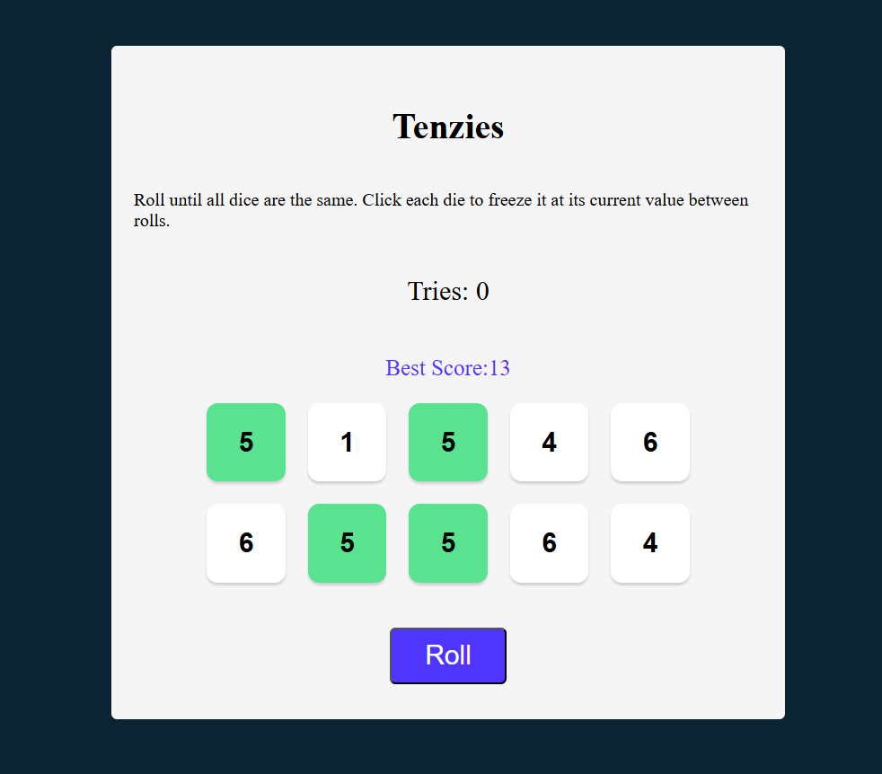
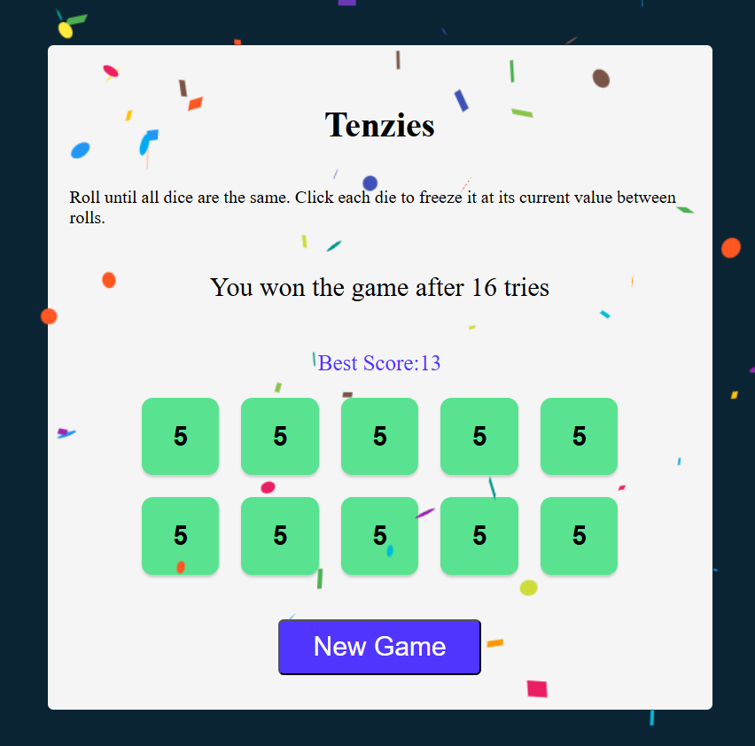

# 🎲 Tenzies Game (React)

A simple Tenzies dice game built using **React** where players roll dice and hold matching values to try and win the game in as few tries as possible. The game keeps track of your **current tries**, and also records your **best score** using `localStorage`. Confetti 🎉 celebrates your win, and you’ll be notified if you set a new personal record!

Site is live at [site](https://tenzies-theta-amber.vercel.app/)

---

## 🚀 Features

- 🎯 Hold dice to lock values
- 🎲 Reroll remaining dice
- 🧠 Track number of tries
- 🏆 Save and display best score (lowest roll count)
- 🎉 Confetti celebration on win
- 💬 Message when new best score is set

---

## 🛠️ Built With

- React
- NanoID (for unique dice IDs)
- [React Confetti](https://www.npmjs.com/package/react-confetti)

---

## 📦 Installation

```bash
git clone https://github.com/your-username/tenzies-game.git
cd tenzies-game
npm install
npm start
```

---

## 🖥️ Screenshots




---

## 🧩 How to Play

1. Click **Roll** to generate random dice values.
2. Click on a die to **hold** it — held dice won't change on roll.
3. Keep rolling until **all 10 dice** show the **same value**.
4. Try to win in the **fewest number of rolls possible**.
5. Beat your **best score** and get a special message!

---

## 🗃️ Folder Structure

```
src/
├── components/
│   └── Die.js
├── Main.js
├── index.js
└── App.js
```

---

## 📜 License

This project is open source and available under the [MIT License](LICENSE).

---

## 🙌 Acknowledgements

- Inspired by the Scrimba Tenzies tutorial
- Confetti effect via [react-confetti](https://www.npmjs.com/package/react-confetti)

---

## ✍️ Author

Made with ❤️ by [Devjeet Sahu](https://github.com/DevjeetSahu)
